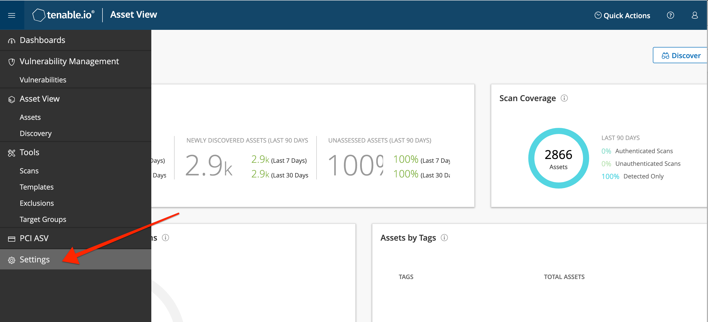
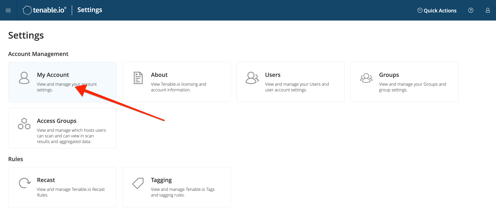
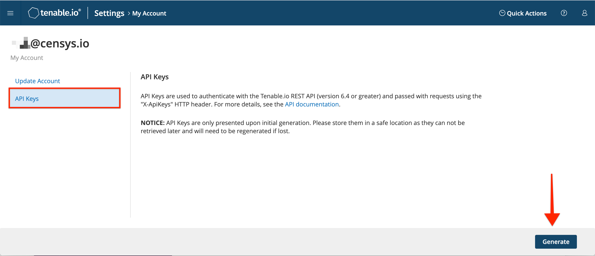
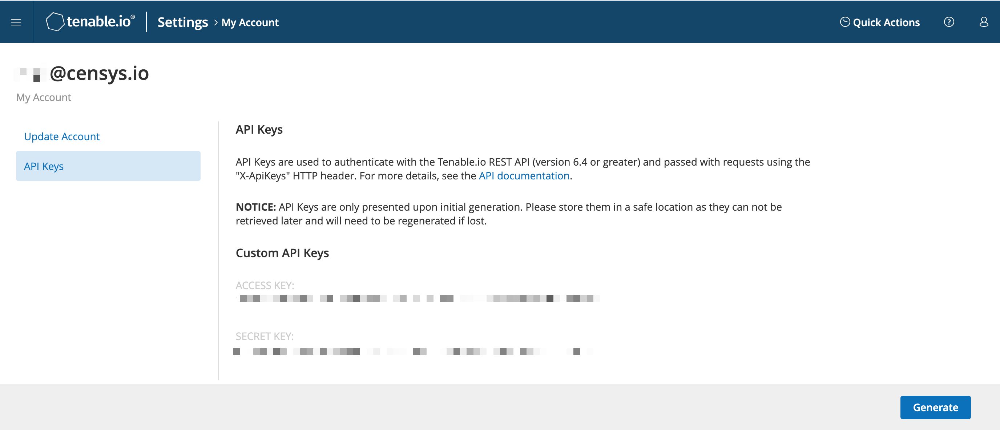
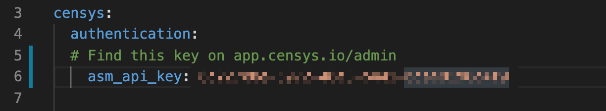
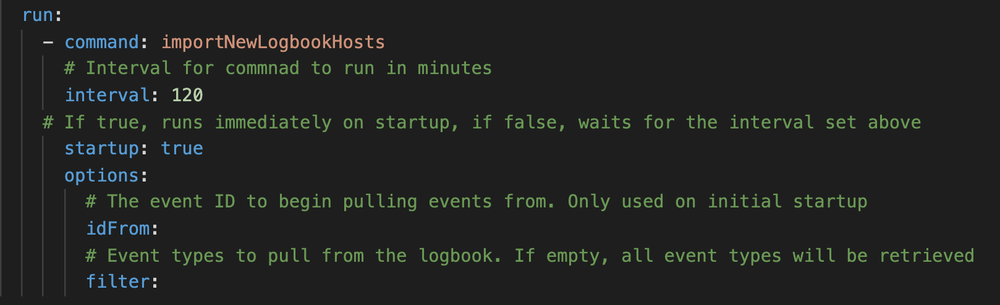
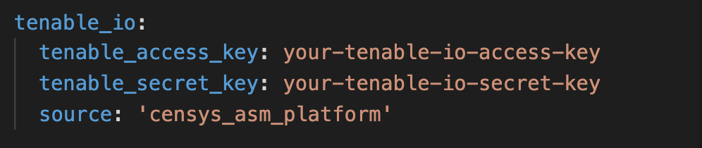
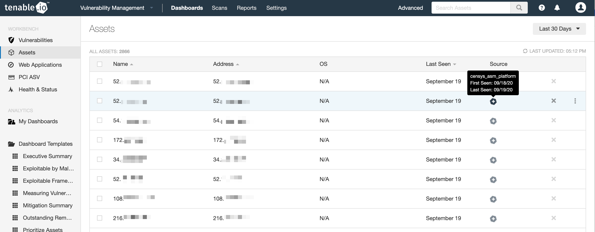

# Censys Tenable.io Integration
v1.0, 2021-03-03
:toc: preamble
:toc-title: In this guide:

The Censys Tenable.io integration sits between the Censys Attack Surface Management platform and your Tenable instance.

The integration queries the platform's logbook API and feeds hosts into Tenable's vulnerability management tool.

## Installation Considerations

The Censys Tenable.io integration is packaged to run in a Docker container, which can be deployed on a variety of infrastructure types. Managing containers is the responsibility of the user. 

This integrations works with Tenable.io instances, not Tenable.se.

[[step-one, step one]]
## Generate Credentials for Tenable.io

In your Tenable.io instance, click the menu icon in the upper left of the screen and select the *Settings* menu option from the menu. 

.Location of Settings in menu

On the Settings page, click on the *My Account* card.

.Location of Account on settings page

On the Account page, navigate to the API Keys tab, and click the *Generate* button.

.API Keys on settings page

After you click the *Generate* button and confirm your choice, an access key and secret key will appear on the page. 

.Custom API Keys shown on account page

This is your only opportunity to view these credentials.

## Set up the Censys Tenable.io Integration

To set up the Censys integration, you must:

. Create a config.yml file in the repo
. Run the docker container

### Create a config file

To create the config file, open the `example_config.yml` file in the repo and fill in the fields with the required information:

#### Authentication

In the `censys` section, provide a value for the `asm_api_key` field by copying and pasting your API key from the link:https://app.censys.io/admin[admin page] in the app.

.Censys ASM platform authentication information

#### Options

In the `options` section, provide values for the following fields:

- `log_level` - Log verbosity for the integration. Default is `INFO`. Valid options are [ `CRITICAL`, `ERROR`, `WARNING`, `INFO`, `DEBUG` ].

- `interval` - An interval for the command in minutes. Default is `120`. Use `-1` if you want the integration to run once and then exit.

.Censys ASM platform run information

#### Tenable

In the `tenable_io` section, provide values for the following fields:

- `tenable_access_key`: The access key generated in your Tenable instance in <<step-one>>.

- `tenable_secret_key`: The secret key generated in your Tenable instance in <<step-one>>.

- `host_source`: The value for the source field in the Tenable hosts. Recommended value is `censys_asm_platform`.

.Censys ASM platform tenable_io information

#### Save Your File

After you've provided values for all the fields in `example_config.yml`, save the file as `config.yml`.

### Run the docker container

Run the following command:

....
docker-compose up -d --build
....

## Results in Tenable

Once the integration begins hosts discovered by Censys will be fed into Tenable's vulnerability management algorithm for scanning and monitoring.

.View hosts in Tenable.io
