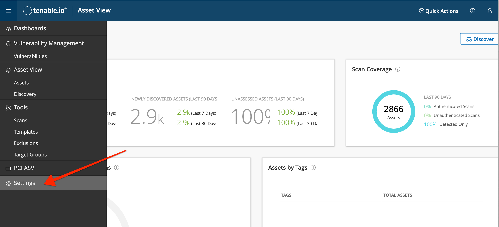
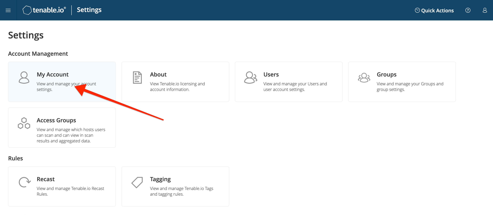
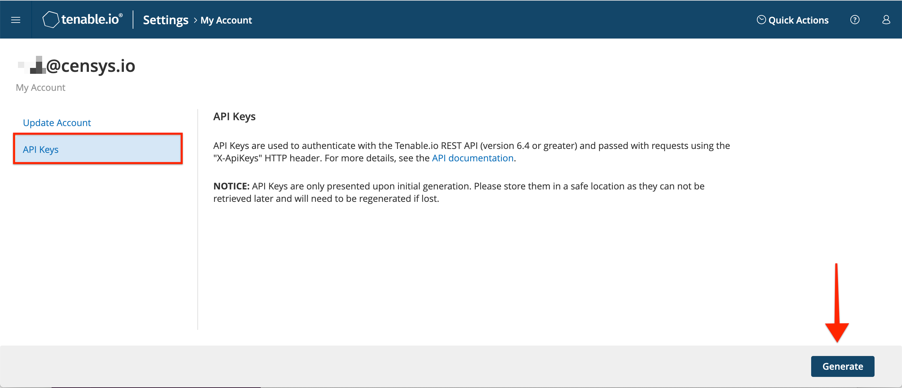
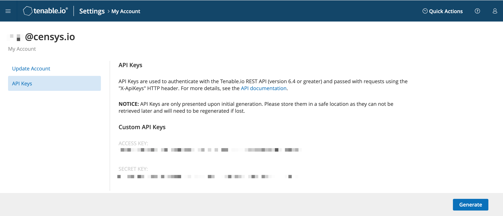
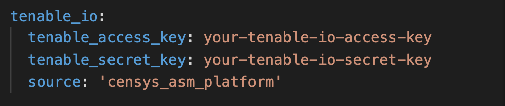

# Censys Tenable.io Integration
v1.0, 2020-09-20
:toc: preamble
:toc-title: In this guide:

The Censys Tenable.io integration sits between the Censys Attack Surface Management platform and your Tenable instance.

The integration queries the platform's logbook API and feeds hosts into Tenable's vulnerability management tool.

## Installation Considerations

The Censys Tenable.io integration is packaged to run in a Docker container, which can be deployed on a variety of infrastructure types. Managing containers is the responsibility of the user. 

This integrations works with Tenable.io instances, not Tenable.se.

[[step-one, step one]]
## Generate Credentials for Tenable.io

In your Tenable.io instance, click the menu icon in the upper left of the screen and select the *Settings* menu option from the menu. 

.Location of Settings in menu

On the Settings page, click on the *My Account* card.

.Location of Account on settings page

On the Account page, navigate to the API Keys tab, and click the *Generate* button.

.API Keys on settings page

After you click the *Generate* button and confirm your choice, an access key and secret key will appear on the page. 

.Custom API Keys shown on account page

This is your only opportunity to view these credentials.

## Set up the Censys Tenable.io Integration

To set up the Censys integration, you must:

. Create a settings.yaml file in the repo
. Build the docker container
. Run the application

### Create a settings file

To create the settings file, open the `settings_example.yaml` file in the repo and fill in the fields with the required information:

#### Authentication

In the `authentication` section, provide a value for the `asm_api_key` field by copying and pasting your API key from the link:https://app.censys.io/admin[admin page] in the app.

.Censys ASM platform authentication information
image::images/authentication.png[Authentication]

#### Run

In the `run` section, provide values for the following fields:

- `interval` - An interval for the command in minutes. Default is 60.

- `startup` - A boolean for whether to run the command immediately on startup (`true`) or wait the interval prescribed in `interval` (`false`).

- `idFrom` - The Censys logbook event ID to begin pulling events from at startup. Logbook event IDs increase sequentially from 1. If empty, all events will be pulled on startup.

- `filter` - A list of event types to pull from the logbook. If empty, all event types will be retrieved.

.Censys ASM platform run information
image::images/run.png[Run]

#### Tenable

In the `tenable_io` section, provide values for the following fields:

- `tenable_access_key`: The access key generated in your Tenable instance in <<step-one>>.

- `tenable_secret_key`: The secret key generated in your Tenable instance in <<step-one>>.

- `source`: The value for the source field in the Tenable hosts. Recommended value is `censys_asm_platform`.

.Censys ASM platform tenable_io information

#### Save Your File

After you've provided values for all of the fields in `settings_example.yaml`, save the file as `settings.yaml`.

### Build the docker container

Run the following command on your terminal:

....
./censys-tenable-io.sh build
....

### Run the docker container

Run the following command:

....
./censys-tenable-io.sh run
....

If you want to test the integration with a single run, use the following command:

....
./censys-tenable-io.sh once
....

## Results in Tenable

After the integration begins sending Censys logbook events to Tenable.io, hosts discovered by Censys will be fed into Tenable's vulnerability management algorithm for scanning and monitoring.

.View hosts in Tenable.io
image::images/hosts-in-tenable.png[View hosts in Tenable.io]